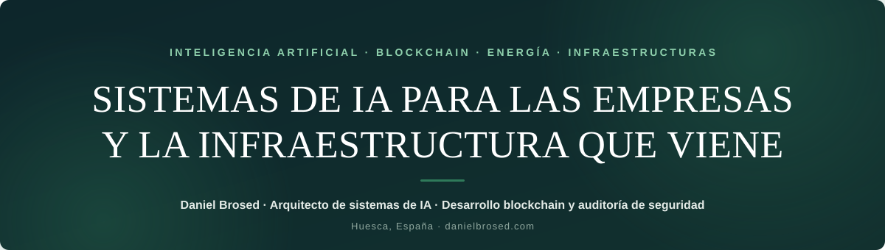
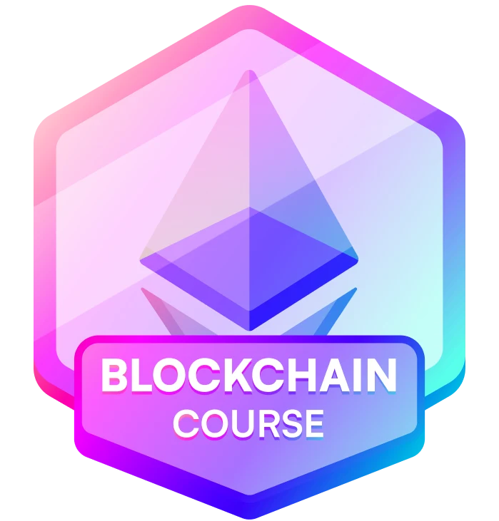
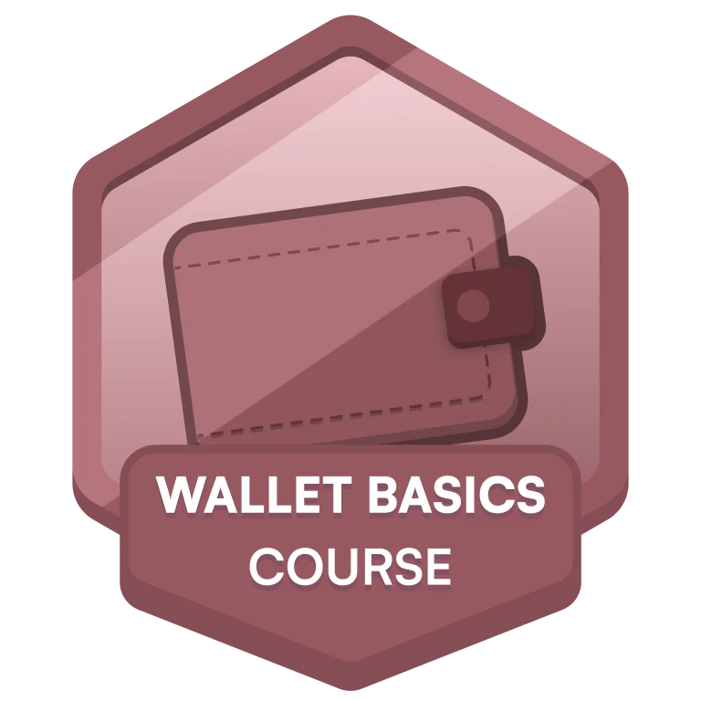
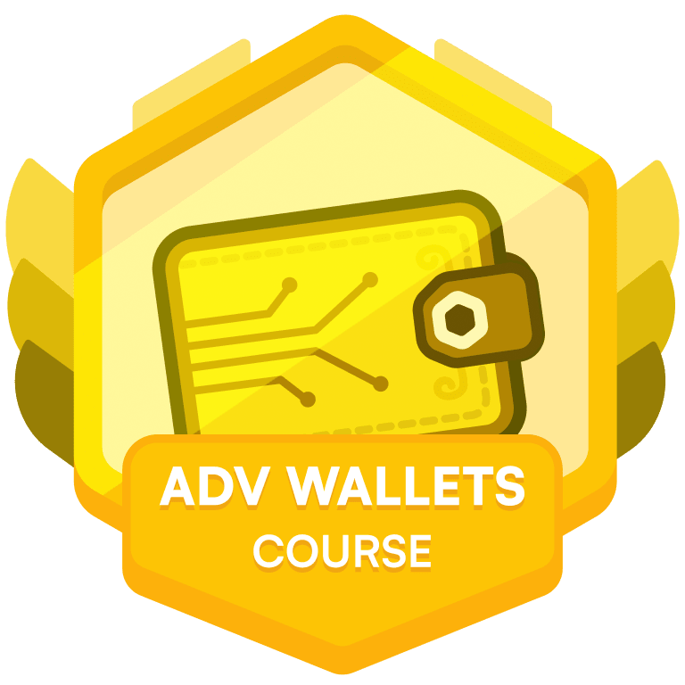
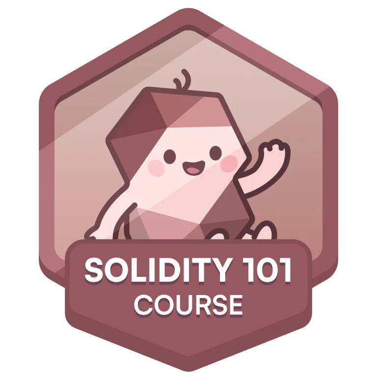
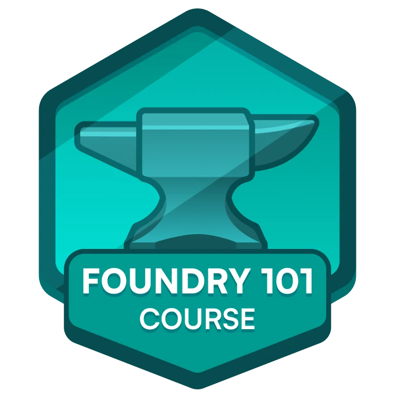
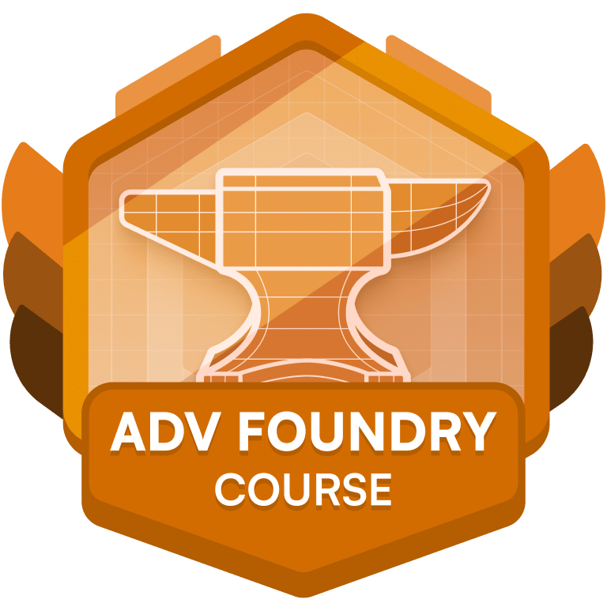
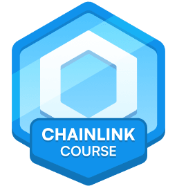
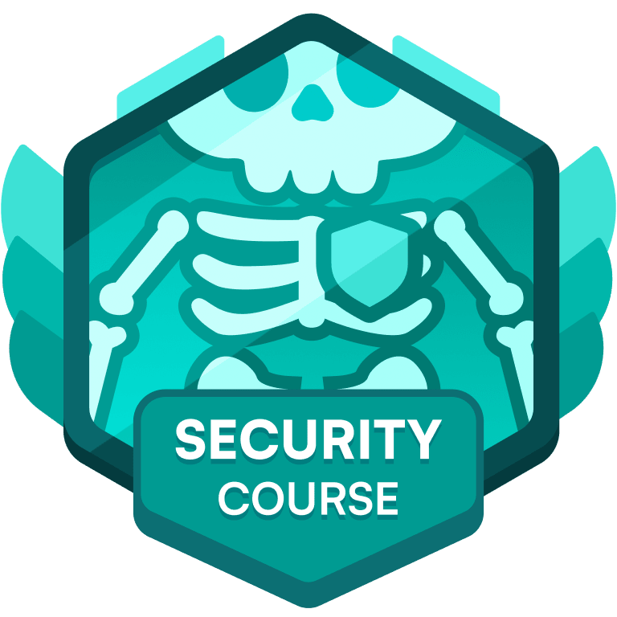
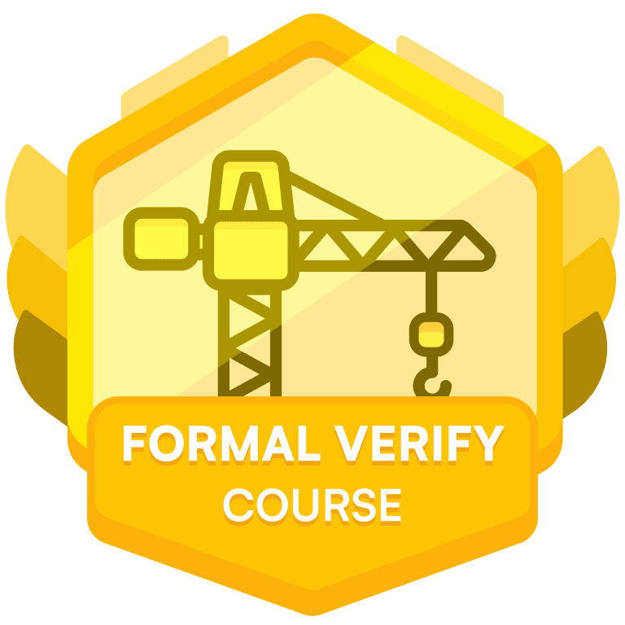

  

  
  
  
  
  

Construyo sistemas de inteligencia artificial, formo a equipos y desarrollo una visión que une 
computación, energía renovable y almacenamiento para la infraestructura de IA que viene.

  

## TRES FORMAS DE TRABAJAR CON IA

No empiezo por la herramienta. Empiezo por el proceso que más tiempo, dinero y energía te está costando.

| 01 · Sistemas de IA | 02 · Formación para equipos | 03 · Seguridad de apps con IA |
| :--- | :--- | :--- |
| Diseño y construyo agentes, automatizaciones y software interno para que un proceso repetitivo deje de depender de una persona, una hoja de cálculo o una cadena de mensajes. | Formo a equipos para que usen inteligencia artificial con criterio en su trabajo diario: con sus procesos, sus herramientas y casos que puedan aplicar al día siguiente. | Reviso aplicaciones creadas o aceleradas con IA antes de que expongan claves, datos, permisos o accesos que no deberían estar abiertos. |
| Automatización de procesos · Agentes de IA · Software interno · Integraciones | Sesiones prácticas · Casos reales · Priorización · Uso responsable | Autenticación · Accesos · Datos · OWASP |
| [Ver sistemas de IA →](https://danielbrosed.com/#sistemas-ia) | [Ver formación en IA →](https://danielbrosed.com/formacion-ia-empresas/) | [Ver auditorías de seguridad →](https://danielbrosed.com/#seguridad) |

## CASOS REALES

Resultados concretos. No promesas de «transformación».

| DE 3 H 04 MIN A 5 MIN | 29 HALLAZGOS · 5 DE ELLOS GRAVES |
| :--- | :--- |
| **Cesea Agenc.ia · agencia de marketing full stack.** Diseño y construyo una capa de automatización y agentes de IA para apoyar la captación, la investigación de cuentas, la cualificación de oportunidades, el seguimiento comercial y la producción interna. Cualificar una cuenta nueva pasó de 3 h 04 min a 5 min. | **Balority · red social del ecosistema startup.** Revisé la capa de aplicación con metodología OWASP e identifiqué 29 hallazgos de seguridad, cinco de ellos graves. Después construí un flujo interno de agentes de IA que ayuda a encontrar perfiles afines dentro de la red y facilita conexiones sin intervención manual. |
| [Ver Cesea Agenc.ia →](https://ceseagencia.com/) | [Ver Balority →](https://balority.app/) |

> Los sistemas no sustituyen el criterio de un equipo. Quitan de en medio el trabajo que no necesita hacerlo una persona.

## VISIÓN · LA IA NECESITA COMPUTACIÓN. LA COMPUTACIÓN NECESITA ENERGÍA.

La expansión de la inteligencia artificial no depende solo de modelos y software. También depende de la energía disponible para entrenar, desplegar y operar sistemas de computación. Por eso mi trabajo une dos líneas que hoy desarrollo por separado, pero que cada vez están más conectadas: sistemas de IA y almacenamiento energético.

| 01 · COMPUTACIÓN | 02 · ENERGÍA | 03 · ALMACENAMIENTO |
| :--- | :--- | :--- |
| Los sistemas de IA necesitan capacidad de cálculo, infraestructura técnica y un uso eficiente de los recursos que los sostienen. | La capacidad de computación necesita energía estable. Cuando la red tiene límites, el consumo y la disponibilidad se convierten en una parte del problema tecnológico. | Las renovables y las baterías ayudan a gestionar mejor cuándo se produce, se guarda y se utiliza esa energía. |

**VaultGrid Labs** es mi proyecto de sistemas de almacenamiento de energía con baterías para empresas. Está orientado inicialmente a Aragón y Cataluña y se centra en entender el consumo, dimensionar una solución y coordinar el suministro del equipo. Es una línea independiente de mi consultoría de IA, pero forma parte de la misma dirección: comprender cómo la energía y la computación van a condicionar los sistemas que construiremos en los próximos años. → [Conocer VaultGrid Labs](https://vaultbit.es/vaultgrid)

No es un data center operativo. No es una promesa. Es la dirección estratégica sobre la que estoy trabajando.

## SOBRE MÍ

**Construyo software desde los 14 años. Antes trabajé dentro de un hospital.**

Antes de dedicarme a sistemas de inteligencia artificial, trabajé como auxiliar de enfermería, técnico de imagen para el diagnóstico y técnico de radioterapia y dosimetría. Sé lo que es responder rápido cuando hay poco margen de error, y lo que es trabajar con protocolos, datos sensibles y herramientas que tienen que funcionar cuando hacen falta. Hoy aplico esa misma forma de trabajar al diseño de sistemas de IA, automatización, formación y seguridad: entender el contexto antes de proponer una solución, documentar lo importante y construir con criterio.

## TRABAJO SELECCIONADO

| Proyecto | Qué es | Construido con |
| :--- | :--- | :--- |
| [Sole Hand](https://github.com/danielbrosed/SOLE-HAND-PROYECT) | Comunidad de emprendedores diseñada y construida desde cero: web en tres idiomas, app instalable, backend autoalojado, pagos y un programa de seguridad en seis fases. Web y app en producción desde agosto de 2026. | React, TypeScript, Supabase, PostgreSQL, Stripe, Docker |
| [Red de formación y empleo](https://github.com/danielbrosed/RECONNECTIA-) | Construida para una empresa de formación como su desarrollador full stack principal: una red profesional donde alumnos, empresas, centros y formadores se encuentran, se forman y se contratan. En producción desde junio de 2026. Su [landing](https://github.com/danielbrosed/RECONNECTIA-WEBSITE) también es pública. | Next.js, React, Prisma, PostgreSQL, Auth.js |
| [Vaultbit website](https://github.com/danielbrosed/vaultbit-website) | La web de Vaultbit, consultoría de custodia y herencia de Bitcoin: páginas de servicio guiadas por datos, archivo de newsletter y dos embudos de captación. | Astro, TypeScript, GSAP |
| [Vaultbit Ops](https://github.com/danielbrosed/vaultbit-ops) | La consola interna desde la que opero mi propio trabajo: pipeline, presupuestos y contratos con salida en PDF, motor de precios y tableros alimentados por flujos automatizados. | Next.js, React, Supabase, n8n |
| [Web de agencia](https://github.com/danielbrosed/cesea-agencia-case-study) | Construida para una agencia de marketing: un sitio editorial con coreografía de scroll hecha a mano y un backend que trata cada lead como entrada no confiable. | Next.js, React, Tailwind CSS, Framer Motion |
| [Panel de operaciones clínicas](https://github.com/danielbrosed/kortex-mission-control) | Diseño de producto para clínicas que operan agentes de IA de teléfono y mensajería: 23 pantallas de alta fidelidad, sistema de diseño y arquitectura de agentes. | HTML, CSS, design tokens |
| [danielbrosed.com](https://github.com/danielbrosed/danielbrosed-com) | Mi web personal y el archivo de mis newsletters. Snapshot público saneado. | Vite, React, GSAP, Lenis |

**Ahora mismo, construyendo:**

<a href="https://github.com/danielbrosed/SOLE-HAND-PROYECT#build-progress">
  <picture>
    <source media="(prefers-color-scheme: dark)" srcset="https://raw.githubusercontent.com/danielbrosed/SOLE-HAND-PROYECT/main/docs/progress/compact-dark.svg">
    
  </picture>
</a>

## SEGURIDAD EVM · FORMACIÓN DE AUDITORÍA

Vectores que cubre el track de seguridad de smart contracts que he completado en Cyfrin Updraft, y con los que practico en Solidity:

| 01 · Lógica y control | 02 · Oráculos y DeFi | 03 · Criptografía y claves |
| :--- | :--- | :--- |
| Reentrancy (cross y read-only) | Manipulación spot vs TWAP | Replay de firmas EIP-712 |
| Invariantes de máquina de estados | Flash loans | Derivación de claves BIP-39 |
| Control de acceso y proxies | Redondeo y pérdida de precisión | Account abstraction ERC-4337 |
| Valores de retorno sin comprobar | Slippage y ataques sandwich | Multisig y Safe guards |

Toolchain del track: **Foundry** (forge, cast, anvil: fuzzing, invariant testing y forking de mainnet) · **Slither** (análisis estático) · **Echidna / Medusa** (fuzzing) · **Aderyn**.

## CREDENCIALES

**Anthropic Academy** — formación continua en sistemas de IA: diez certificaciones de la formación oficial de Anthropic, completadas en julio de 2026.

<table width="100%">
  <tr><td>Claude Code in Action</td><td>Introduction to Subagents</td></tr>
  <tr><td>Introduction to Model Context Protocol</td><td>AI Fluency for Builders (con CodePath)</td></tr>
  <tr><td>Model Context Protocol: Advanced Topics</td><td>AI Fluency for Small Businesses (con PayPal)</td></tr>
  <tr><td>Claude with the Anthropic API</td><td>Claude with Amazon Bedrock</td></tr>
  <tr><td>Introduction to Agent Skills</td><td>Claude with Google Vertex AI</td></tr>
</table>

**Cyfrin Updraft** — el itinerario completo de desarrollo y seguridad de smart contracts, nueve insignias:

<table align="center">
  <tr>
    <td align="center" width="33%"> <b>Blockchain Basics</b></td>
    <td align="center" width="33%"> <b>Wallet Basics</b></td>
    <td align="center" width="33%"> <b>Advanced Wallets</b></td>
  </tr>
  <tr>
    <td align="center"> <b>Solidity 101</b></td>
    <td align="center"> <b>Foundry Fundamentals</b></td>
    <td align="center"> <b>Advanced Foundry</b></td>
  </tr>
  <tr>
    <td align="center"> <b>Chainlink Fundamentals</b></td>
    <td align="center"> <b>Smart Contract Security</b></td>
    <td align="center"> <b>Assembly &amp; Formal Verification</b></td>
  </tr>
</table>

## STACK

| Área | Herramientas |
| :--- | :--- |
| Lenguajes | TypeScript, JavaScript, SQL, Solidity |
| Front end | React, Next.js, Vite, Astro, Tailwind CSS, GSAP |
| Back end | Node.js, Deno, PostgreSQL, Supabase, Prisma, Auth.js, Zod |
| Pagos y flujos | Stripe, n8n, SMTP |
| Entrega | Docker, nginx, GitHub Actions |
| Calidad y seguridad | Playwright, node:test, gitleaks, npm audit, revisiones basadas en OWASP, Foundry, Slither |

  

**Cómo trabajo:**

- La base de datos decide quién ve qué. Row-level security primero: la pantalla nunca tiene la última palabra.
- Los secretos no entran en los repositorios, y el código de producción se queda en privado. Lo público aquí es documentación y código seleccionado.
- El estado se cuenta claro: qué está en producción, qué está construido y qué está todavía en plan.

## ACTIVIDAD

  
  

  <picture>
    <source media="(prefers-color-scheme: dark)" srcset="https://raw.githubusercontent.com/danielbrosed/danielbrosed/output/github-snake-dark.svg">
    
  </picture>

  

---

  <b>NO VENGO A LLENAR TU EMPRESA DE «IA». VENGO A ENTENDER SI HAY UN PROBLEMA REAL QUE UN SISTEMA PUEDA RESOLVER.</b>

  © 2026 Daniel Brosed · Hecho a mano. Sin plantillas. · Huesca, España · Proyectos en remoto y presencial. 
  <a href="https://danielbrosed.com">danielbrosed.com</a> · <a href="https://vaultbit.es">vaultbit.es</a> · <a href="https://solehand.com">solehand.com</a>

